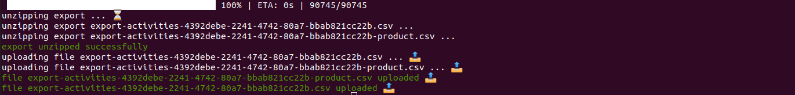
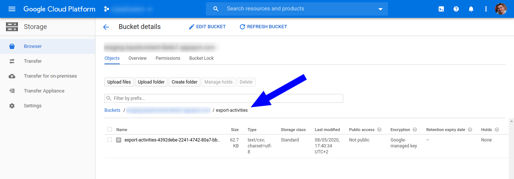
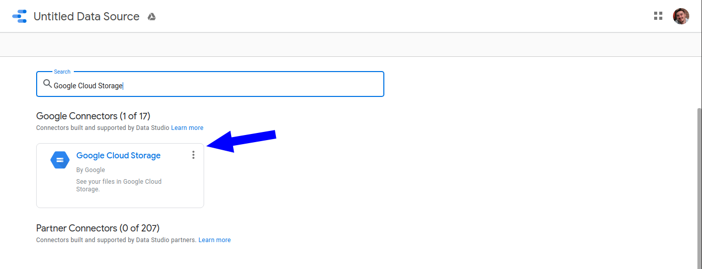
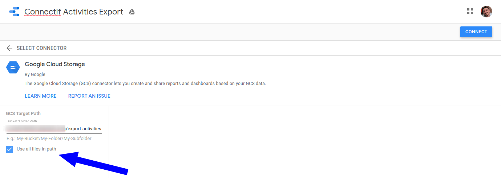
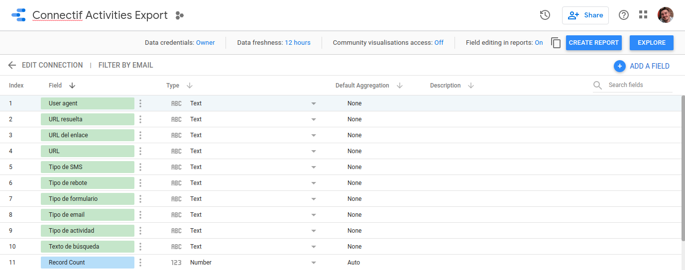
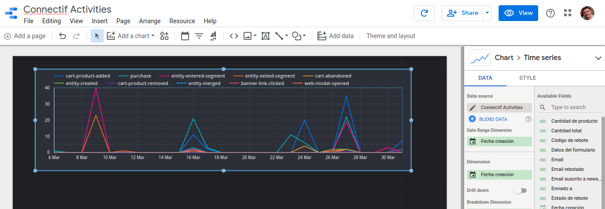
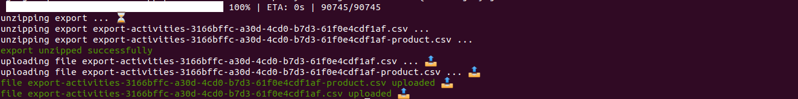
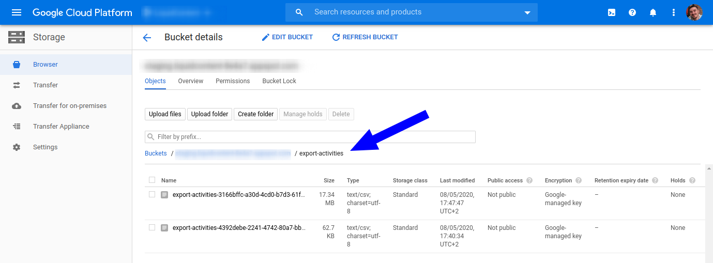

# connectif-2-gc-storage

[](https://www.npmjs.com/package/connectif-2-gc-storage)
[](https://github.com/francescorivola/connectif-2-gc-storage/actions)
[](https://www.codefactor.io/repository/github/francescorivola/connectif-2-gc-storage)
[](https://codecov.io/gh/francescorivola/connectif-2-gc-storage)
[](https://dependabot.com/)
[](https://hub.docker.com/r/francescorivola/connectif-2-gc-storage)

A CLI that makes extremely easy automate export data from the [Connectif Marketing Automation Platform](https://www.connectif.ai) and upload it to [Google Cloud Storage](https://cloud.google.com/storage).

## Installation

Install the [NodeJs](https://nodejs.org) runtime.

Now, from your favourite shell, install the CLI by typing the following command:

```
$ npm install -g connectif-2-gc-storage
```

## Prerequisites

Before run the CLI we must ensure we have all the credentials in place in order to access the Connectif API and the Google Cloud Platform:

- **Connectif Api Key**: get a Connectif Api Key with permission to write and read exports following the instructions that can be found here: https://api-docs.connectif.cloud/connectif-api/guides/authentication.
- **Google Cloud Credentials**: get a credential file from the Google Cloud Console with permission to write into your Google Cloud Storage account (see instruction here https://cloud.google.com/docs/authentication/getting-started).

## Usage

The usage documentation can be found running the CLI with the help flag:

```
$ connectif-2-gc-storage --help
```

Output:

```
Usage: connectif-2-gc-storage [options] [command]

CLI to automate Connectif data export uploading to Google Cloud Storage

Options:
  -V, --version                   output the version number
  -h, --help                      display help for command

Commands:
  export-activities [options]     export contacts activities.
  export-contacts [options]       export contacts.
  export-data-explorer [options]  export data explorer reports.
  help [command]                  display help for command
```

To get documentation of each command use help. i.e.:

```
$ connectif-2-gc-storage help export-activities
```

Output:

```
Usage: connectif-2-gc-storage export-activities [options]

export contacts activities.

Options:
  -k, --gcKeyFileName <path>      Path to a .json, .pem, or .p12 Google Cloud key file (required).
  -b, --gcBucketName <name>       Google Cloud Storage bucket name (required).
  -a, --connectifApiKey <apiKey>  Connectif Api Key. export:read and export:write scopes are required (required).
  -f, --fromDate <fromDate>       filter activities export created after a given date (required).
  -t, --toDate <toDate>           filter activities export created before a given date (required).
  -s, --segmentId <segmentId>     filter the activities export of contacts in a given segment.
  -h, --help                      display help for command
```

## Docker

In case you want to run the CLI using docker you can with the following commands:

The below will print the version of the CLI:

```
docker run --rm francescorivola/connectif-2-gc-storage:latest
```

The below will run the CLI with the given options:

```
docker run --rm -v $(pwd)/key.json:/home/node/key.json francescorivola/connectif-2-gc-storage:latest \
  export-activities \
  --gcKeyFileName=./key.json \
  --gcBucketName=$BUCKET_NAME \
  --connectifApiKey=$CONNECTIF_API_KEY \
  --fromDate=$FROM_DATE \
  --toDate=$TO_DATE
```

## Use Case

An use case for this tool is to automate data analysis with [Google Data Studio](https://datastudio.google.com/). Once the csv files are exported in Google Cloud Storage we can use it to feed Google Data Studio through its Google Cloud Storage Connector.

### First Export/Import

We run a first time the CLI to export Connectif contacts activities of March.

```
$ connectif-2-gc-storage export-activities \
  --gcKeyFileName ./key.json \
  --gcBucketName $BUCKET_NAME \
  --connectifApiKey $CONNECTIF_API_KEY \
  --fromDate 2020-02-28T23:00:00.000Z \
  --toDate 2020-03-31T22:00:00.000Z
```



Once done, we can check the result and we can see we have a csv file result under a folder **export-activities** in our bucket.



### Connect GCS to Google Data Studio

First of all we add a new Google Cloud Storage **Data Source**.



Then we configure the connector checking the checkbox **Use all files in path** and we add the path composed by **BUCKET_NAME/export-activities**. Finally we click in the **Connect** button.



We configure our fields (for this example we just take the fields as come from the csv).



We start creating reports :).



### Second Export/Import

Now that we have configured our Google Cloud Storage with Google Data Studio and we have created our report/s we can run the CLI to add more data. This time let's export contacts activities of April.

```
$ connectif-2-gc-storage export-activities \
  --gcKeyFileName ./key.json \
  --gcBucketName $BUCKET_NAME \
  --connectifApiKey $CONNECTIF_API_KEY \
  --fromDate 2020-03-31T22:00:00.000Z \
  --toDate 2020-04-30T22:00:00.000Z
```



If we check the Google Cloud Storage Browser we will see 2 csv files under our export-activities folder, the previous one and the new one imported.



Now, let's go back to our report in Google Data Studio, click in the **Refresh** button and the report will automatically update adding the April month data :).


Happy Data Analysis!!

## License

MIT
